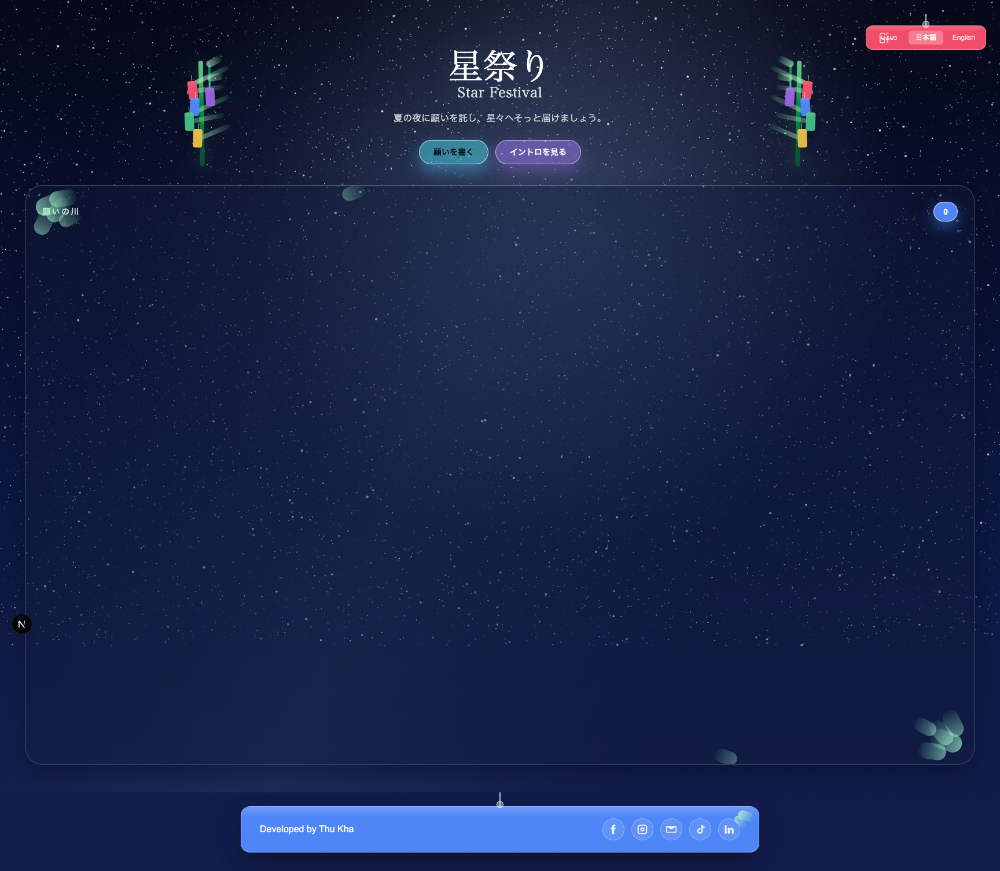

# Star Festival (七夕の星祭り)

Modern, emotional, multilingual Tanabata festival website UI.

## Live UI Screens

### English (EN)


### Japanese (日本語)


## Features
- Multilingual UI: `မြန်မာ` / `日本語` / `English`
- Wish submission with moderation and validation
- Approved wishes public listing (Wish River)
- Animated Tanzaku card interactions
- Intro modal in 3 languages
- Responsive design (desktop + mobile)

## Tech Stack
- Next.js 16 + React + TypeScript
- Tailwind CSS
- Framer Motion
- Supabase
- Zod
- Playwright + Vitest

## Quick Start
```bash
cp .env.example .env.local
npm install
npm run dev
```

## Required Environment Variables
- `NEXT_PUBLIC_SUPABASE_URL`
- `NEXT_PUBLIC_SUPABASE_PUBLISHABLE_DEFAULT_KEY` (or `NEXT_PUBLIC_SUPABASE_ANON_KEY`)
- `SUPABASE_SERVICE_ROLE_KEY`

## Build
```bash
npm run build
```

## Deployment
See full deployment plan:
- [deploy_spec.md](deploy_spec.md)
